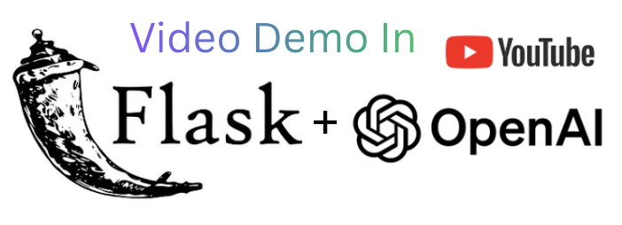
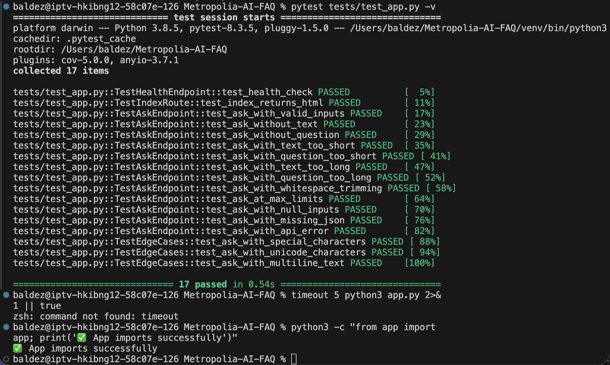

# 📚 Metropolia UAS Course FAQs Assistant

A Flask web application that uses OpenAI's large language models LLMs to assist Metropolia students and staff by providing instant answers to questions about course materials. Users can paste lecture notes and ask questions, and the AI will deliver concise, helpful responses. 

- The backend (`app.py`) exposes an `/ask` endpoint that validates input and queries OpenAI, while the frontend (`templates/index.html`, `static/script.js`, `static/styles.css`) provides a simple UI for pasting lecture text, asking questions and viewing results. Tests are included (`tests/test_app.py`) and dependencies are listed in `requirements.txt`.

## 🎯 Problem Solved

Students often need quick summaries, clarifications or key takeaways from lectures. This tool empowers them with an AI assistant that:
- Summarizes complex topics
- Answers specific questions about course material
- Helps study and retain information
- Saves time on note review

## ✨ Features

- **Easy to use**: Paste lecture text and type your question
- **Fast responses**: Get AI-powered answers in seconds
- **Professional UI**: Clean, modern, responsive design
- **Error handling**: Helpful error messages and validation
- **Metropolia-focused**: System prompt tailored for educational use

## 🚀 Quick Start

### Prerequisites
- Python 3.8+
- Download the Flutter SDK from [flutter.dev](https://flutter.dev/docs/get-started/install), make the Flutter SDK is in the same directory/folder as this project.
- OpenAI API key ([get one here](https://platform.openai.com/api-keys))

### Installation

1. **Clone the repository**
   ```bash
   git clone https://github.com/baldez300/Metropolia-AI-FAQ.git
   cd Metropolia-AI-FAQ
   ```

2. **Create virtual environment**
   ```bash
   python3 -m venv venv
   source venv/bin/activate  # On Windows: venv\Scripts\activate
   ```

3. **Install dependencies**
   ```bash
   pip install -r requirements.txt
   ```

4. **Set up environment variables**
   ```bash
   # Option A: Create .env file
   cp .env.example .env
   # Edit .env and add your OpenAI API key
   
   # Option B: Export directly
   export OPENAI_API_KEY="sk-your-key-here"
   ```

5. **Run the application**
   ```bash
   python3 app.py
   ```

6. **Open in browser**
   Navigate to `http://127.0.0.1:5000`

## 💡 Usage Examples

### Example 1: Summarization
**Text:** Paste a 10-minute lecture transcript
**Question:** "Summarize this lecture in 3 bullet points"
**Result:** Key takeaways displayed instantly

### Example 2: Concept Clarification
**Text:** Chapter on machine learning from course notes
**Question:** "Explain what overfitting means in simple terms"
**Result:** Clear explanation relevant to the lecture

### Example 3: Study Prep
**Text:** Course material on a specific topic
**Question:** "What are the most important concepts for the exam?"
**Result:** Focused study guide

## 📸 UI Screenshot & Demo

### User Interface
A screenshot of the application interface UI:


### Demo Video
Watch a short walkthrough of the app:

[](https://youtu.be/pNiwXZcHoWM)

Click the image above to watch the full demo on YouTube.

## 🔧 Project Structure

```
Metropolia-AI-FAQ/
├── app.py                 # Flask backend with API logic
├── requirements.txt       # Python dependencies
├── .env.example           # Environment template
├── README.md              # This file
├── templates/
│   └── index.html         # Web interface
├── static/
│   ├── styles.css         # Styling
│   └── script.js          # Frontend JavaScript (validation + API calls)
└── tests/
   └── test_app.py        # Unit tests for backend endpoints
```

## 📝 Technologies Used

- **Backend**: Flask (Python web framework)
- **AI**: OpenAI API (gpt-4o-mini model)
- **Frontend**: HTML, CSS, JavaScript (vanilla)
- **Environment**: python-dotenv for configuration

## ⚙️ Configuration

The app uses the following environment variables (see `.env.example`):

```
OPENAI_API_KEY=your-openai-api-key
```

**Model**: `gpt-4o-mini` (cost-effective and fast)
**Max Tokens**: 300 (adjustable in `app.py`)
**Temperature**: 0.2 (low for consistent, focused answers)

## 🧪 Testing

Unit tests are included to ensure the backend endpoints work correctly.

### Run Tests

```bash
# Install test dependencies
pip install -r requirements.txt

# Run all tests
pytest tests/test_app.py -v

# Run tests with coverage report
pytest tests/test_app.py --cov=app --cov-report=html
```

## 📸 Testing Screenshot
A screenshot of test results in terminal:



### Test Coverage

Tests cover:
- ✅ Valid inputs and successful responses
- ✅ Input validation (empty, too short, too long)
- ✅ Boundary conditions (inputs at exactly max/min limits)
- ✅ Special characters and Unicode handling
- ✅ API error handling
- ✅ Health check endpoint

## 🐛 Troubleshooting
If you encounter issues, check the the code logic and ensure all dependencies are installed. 
#### Common problems:

### "OPENAI_API_KEY not set"
- Ensure you've created a `.env` file with your API key
- Or set it via terminal: `export OPENAI_API_KEY="sk-..."`

### "ModuleNotFoundError: No module named 'flask'"
- Make sure your virtual environment is activated: `source venv/bin/activate`
- Reinstall dependencies: `pip install -r requirements.txt`

### "API connection error"
- Check your internet connection
- Verify your API key is valid at https://platform.openai.com
- Check OpenAI service status

### "Answer is too generic"
- Provide more detailed lecture text
- Ask more specific questions
- The system prompt can be modified in `app.py`

## 🎓 Learning Outcomes

This project demonstrates:
- ✅ Flask web application development
- ✅ RESTful API design
- ✅ Integration with external APIs (OpenAI)
- ✅ Frontend-backend communication
- ✅ Error handling and validation
- ✅ Environment configuration
- ✅ Clean, maintainable code

## 🚀 Future Enhancements

- [X] Chat history / context persistence
- [ ] Multiple document support
- [ ] User authentication
- [ ] Advanced formatting (markdown, syntax highlighting)
- [ ] Export answers as PDF
- [ ] Support for other LLM providers (Groq, Together.ai, etc)
- [ ] Conversation memory for follow-up questions
- [ ] File upload instead of paste
- [ ] Delete individual Q&A pairs
- [ ] Deployment to cloud platform (Heroku, AWS, etc)

## 📄 License

Open source - use freely for educational purposes

## 👤 Author
- Metropolia University of Applied Sciences alumni: Balde M...
- Created for Metropolia UAS AI Development Project Application

---

**Questions or issues?** Check the troubleshooting section above or create an issue in the repository.